# PyConPL'24 Gliwice 


[repo qr code](assets/repo.png)

## Introduction

Adam Brzyzek - Junior Backend Developer

github: https://github.com/ABrzyzek

linkedin: https://www.linkedin.com/in/adam-brzyzek/

discord: brzyzu

---

Kamil Kulig - Backend Developer

github: https://github.com/KuligKamil

linkedin: https://www.linkedin.com/in/kamil-kulig-81488b89/

discord: kamilkulig


## MongoDB Introduction
MongoDB is a source-available, cross-platform, document-oriented database program. 

Classified as a NoSQL database product, MongoDB utilizes JSON-like documents with optional schemas. 


## Why Mongodb

"If you can’t explain it to a six-year-old, you don’t understand it yourself" 
* Rule ABC
* MongoDB Popularity
* Rumors that it's easy to do MVP & have good Developer Experience
  

### Rule ABC

<!-- who know what is ABC?  -->

Always Be Curious! 

We never use commercially use MongoDB or NoSQL Database.

We always use Relational Databases. Mostly PostgreSQL.

We want to try something new.


### MongoDB Popularity

For showing popularity MongoDB we will show two source StackOverflow 2024 Survey Developer, DB-Engines Ranking.

* StackOverflow 2024 Survey Developer - Database Results

  65,437 Coders from 185 countries around the world.
  [https://survey.stackoverflow.co/2024/technology#most-popular-technologies-database](https://survey.stackoverflow.co/2024/technology#most-popular-technologies-database)

* DB-Engines Ranking
  The DB-Engines Ranking ranks database management systems according to their popularity. The ranking is updated monthly.
  [https://db-engines.com/en/ranking](https://db-engines.com/en/ranking)


* Popularity DB-Engines Ranking - Trend of Document Stores   
  [https://db-engines.com/en/ranking_trend/document+store](https://db-engines.com/en/ranking_trend/document+store)

* DB-Engines Ranking of Document Stores
  [https://db-engines.com/en/ranking/document+store](https://db-engines.com/en/ranking/document+store)

* Method of calculating the scores of the DB-Engines Ranking
  The DB-Engines Ranking is a list of database management systems ranked by their current popularity. We measure the popularity of a system by using the following parameters:

  Number of mentions of the system on websites, measured as number of results in search engines queries. At the moment, we use Google and Bing for this measurement. In order to count only relevant results, we are searching for <system name> together with the term database, e.g. "Oracle" and "database".

  General interest in the system. For this measurement, we use the frequency of searches in Google Trends.

  Frequency of technical discussions about the system. We use the number of related questions and the number of interested users on the well-known IT-related Q&A sites Stack Overflow and DBA Stack Exchange.

  Number of job offers, in which the system is mentioned. We use the number of offers on the leading job search engines Indeed and Simply Hired.

  Number of profiles in professional networks, in which the system is mentioned. We use the internationally most popular professional network LinkedIn.

  Relevance in social networks. We count the number of Twitter (X) tweets, in which the system is mentioned.

  We calculate the popularity value of a system by standardizing and averaging of the individual parameters. These mathematical transformations are made in a way ​​so that the distance of the individual systems is preserved. That means, when system A has twice as large a value in the DB-Engines Ranking as system B, then it is twice as popular when averaged over the individual evaluation criteria.

  In order to eliminate effects caused by changing quantities of the data sources themselves, the popularity score is always a relative value, which should be interpreted in comparison with other systems only.

  The DB-Engines Ranking does not measure the number of installations of the systems, or their use within IT systems. It can be expected, that an increase of the popularity of a system as measured by the DB-Engines Ranking (e.g. in discussions or job offers) precedes a corresponding broad use of the system by a certain time factor. Because of this, the DB-Engines Ranking can act as an early indicator.

  From [https://db-engines.com/en/ranking_definition](https://db-engines.com/en/ranking_definition)

### Summary

  > The best option to learn something new is to create workshop. You have perfect motivation, deadline. 
  Kamil Kulig
  
  MongoDB is the most popular database that as not Relational Database. 

  Spoiler alert! In our opinion solid database for MVP with pleasant Developer Experience.

## Comparison solution for using Python with MongoDB 

We want to use mongodb for fast prototype, fast deliver, high Developer Experience and use FastAPI asynchronously.

FastAPI is awesoooome <3

We would like to use async framework for better performance & scalability.

But remember when you need to use async framework.


We found 4 potential candidates to use them. 

* pymongo [https://github.com/mongodb/mongo-python-driver](https://github.com/mongodb/mongo-python-driver)
  
* motor [https://github.com/mongodb/motor](https://github.com/mongodb/motor)
  
* mongoengine [https://github.com/MongoEngine/mongoengine](https://github.com/MongoEngine/mongoengine)
  
* beanie [https://github.com/BeanieODM/beanie](https://github.com/BeanieODM/beanie)


### Star history comparison with [https://star-history.com/blog/how-to-use-github-star-history](https://star-history.com/blog/how-to-use-github-star-history)


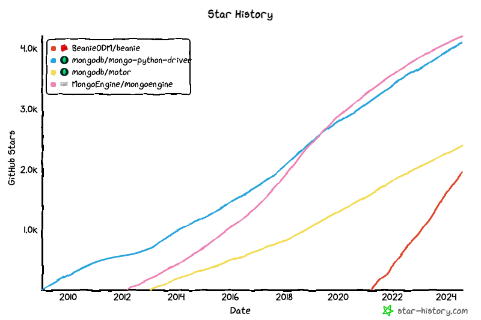


PyMongo and Motor are Python drivers.

MongoEngine and Beanie are ODMs.

Document-Object Mapper (think ORM Object–Relational Mapping, but for document databases).

PyMongo and MongoEngine out - no asynchronous support.

For enter easier in MongoDB world & hype about tool we decide to use Beanie.

Beanie ODM - object-document mapper for MongoDB. Data models are based on Pydantic. 

<!-- how many of use like Pydantic -->

Pydantic for the win.

Beanie wraps Motor, Motor wraps PyMongo. The most popular python drivers.

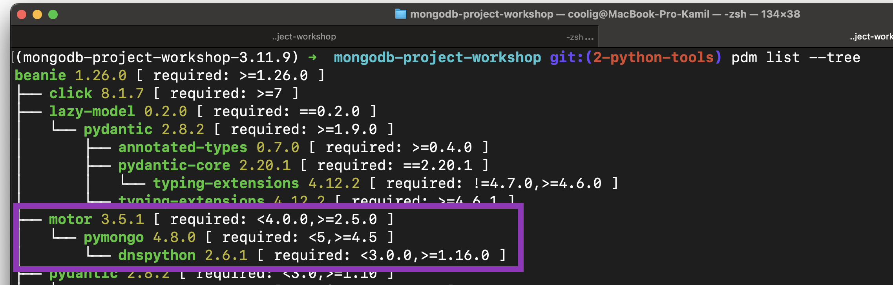


## Reference
* Does MongoEngine support asynchronous drivers (Motor, TxMongo)? [https://mongoengine-odm.readthedocs.io/faq.html?highlight=async](https://mongoengine-odm.readthedocs.io/faq.html?highlight=async)

* Showing wrapping of beanie motor [https://github.com/search?q=repo%3ABeanieODM%2Fbeanie%20motor&type=code](https://github.com/search?q=repo%3ABeanieODM%2Fbeanie%20motor&type=code)
  
* Showing wrapping of motor pymongo
[https://github.com/search?q=repo%3Amongodb%2Fmotor%20pymongo&type=code](https://github.com/search?q=repo%3Amongodb%2Fmotor%20pymongo&type=code)


* Link for generate star history graph [[Star History Chart](https://api.star-history.com/svg?repos=BeanieODM/beanie,mongodb/mongo-python-driver,mongodb/motor,MongoEngine/mongoengine&type=Date)](https://star-history.com/#BeanieODM/beanie&mongodb/mongo-python-driver&mongodb/motor&MongoEngine/mongoengine&Date) 


## Project Setup

1. Clone the source code from the [official GitHub repo for the event](https://github.com/KuligKamil/mongodb-project-workshop)
   
2. Next go to the `mongodb-project-workshop` directory

3. Ensure you are using **Python Version 3.11** **or Higher.** We are using Python 3.11.9 for our project.

<aside>
  HINT: if you need to manage multiple versions of Python 
    
  we recommend to use `pyenv` & `pyenv virtualenv`
  
  [https://github.com/pyenv/pyenv](https://github.com/pyenv/pyenv)
  
  [https://github.com/pyenv/pyenv-virtualenv](https://github.com/pyenv/pyenv-virtualenv)

  For example:

  `pyenv install 3.11.9`

  `pyenv virtualenv 3.11.9 mongo-project-workshop-3.11.9`

  `pyenv local mongo-project-workshop-3.11.9`

</aside> 

4. Setup environment. 
  
<aside>

  HINT: we recommend to use PDM - Python package and dependency manager [https://pdm-project.org/latest/](https://pdm-project.org/latest/)

  <details>
  <summary>how to use pdm</summary>

  install pdm 

  `pip install pdm`

  install all dependencies

  `pdm install`

  run ruff check 

  `pdm run ruff check` 

  if you see `All checks passed!` everything setup correctly 

  </details>
</aside>

 you can use old good `venv` [https://docs.python.org/3/library/venv.html](https://docs.python.org/3/library/venv.html)
 

  <details>
  <summary>how to use `venv`</summary>

  create `venv`

  `python -m venv .`

  next activate it

  on mac, linux or WSL

  `source ./bin/activate`

  or on windows 

  * cmd.exe

  `C:\> .\Scripts\activate.bat`

  * PowerShell

  `PS C:\> .\Scripts\Activate.ps1`

  run ruff check

  `run ruff check`

  if you see `All checks passed!` everything setup correctly 

  </details>
 

5. Create file with environment variables `.envrc` file or `.env` file

<aside>
💡We recommend to use `direnv`  https://direnv.net/

* Load [12factor apps](https://12factor.net/) environment variables
* Create per-project isolated development environments
* Load secrets for deployment
</aside>

* Set the `MONGODB_URI` variable in `.envrc` to for your database connection (It will be shown in the next step, how to get the variables)
* Set the `PYTHONPATH` variable in `.envrc` to your project path
   in mac, linux & WSL `export PYTHONPATH=$PWD`
   in windows [link for tutorial](https://www.youtube.com/watch?v=PXqcHi2fkXI)
### That’s it! You’re ready to work! 🎉


# Tutorial for creating an account in MongoDb Atlas.

MongoDB Atlas is fully managed cloud database that handle all the complexity of:
deploying, managing, and healing your deployments on the cloud service provider of your choice(AWS, Azure, GCP). With Atlas you can create account and set up database with only few clicks.


DBaaS(Database as a Service) is a service that allows to set up, deploy and scale database  without worrying about any physical hardware, software updates and details of configuration for performance.

1. Go to the [MongoDb website](https://www.mongodb.com/products/platform/atlas-database) and press the button **Try Free**.
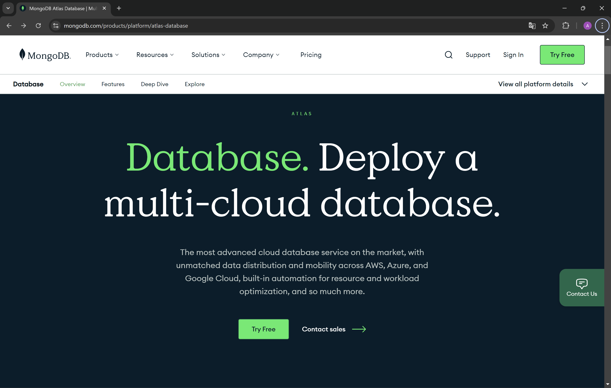
2. Fill your informations and agree for Terms of Service and Privacy Policy. Press **Create your Atlas account** button. You can also use your Google account to create the account.
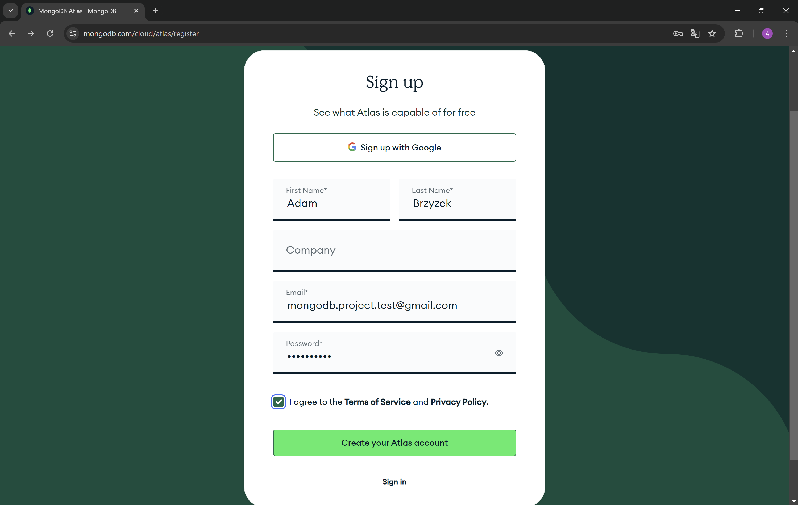
3. Now you need to verify your email address.


4. Complete the answers to the questions below.
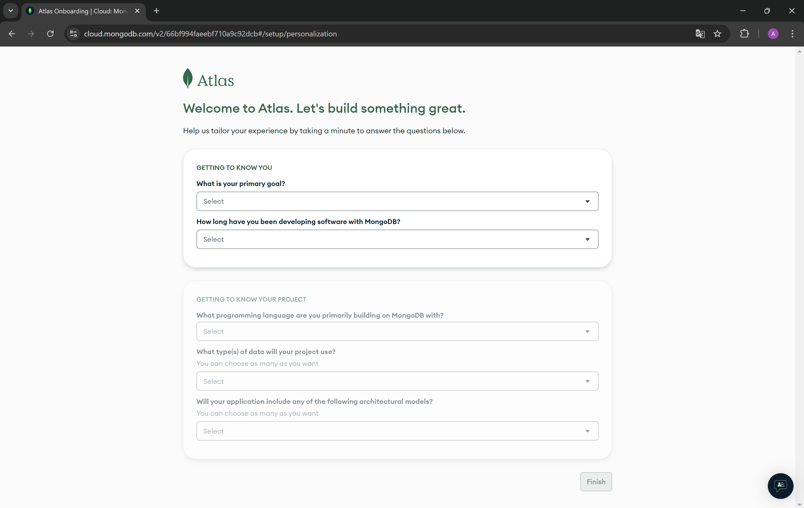
5. Choose M0 tier plan created for learning and exploring MongoDB in a cloud environment. As you can see, you have 512 MB of your storage on cloud provider for free. Enter a name for your cluster. If you do not want to receive sample data, you can uncheck the Preload sample data set option.
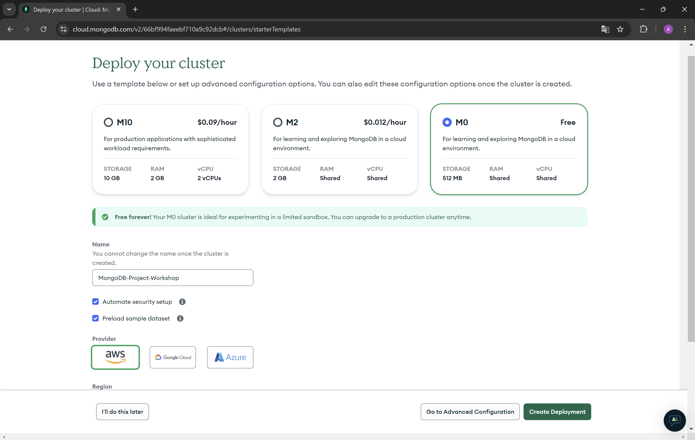
6. Now create a user for your database.
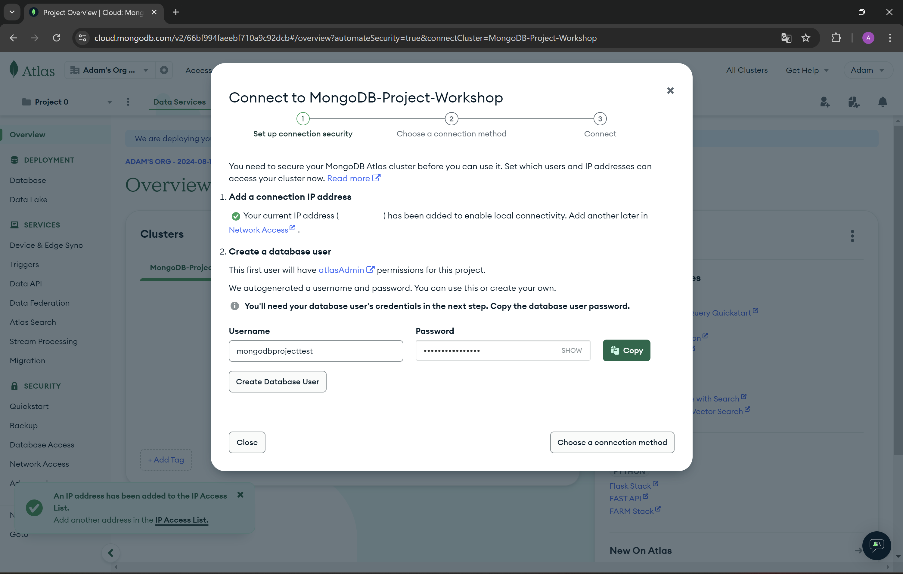
ATTENTION! Save password for user!

## MongoDB as a Documents Database

In MongoDB, databases hold one or more collections of documents.

Collections are analogous to tables in relational databases.

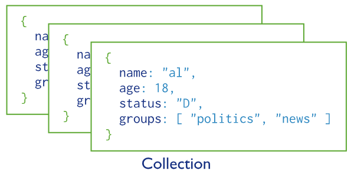
Picture from mongodb.com

MongoDB stores data records as documents (specifically BSON documents) which are gathered together in collections.


JSON 
https://www.mongodb.com/resources/basics/json-and-bson

BSON specification
https://bsonspec.org/

Today, JSON shows up in many different cases:
 
* APIs
* Configuration files
* Log messages
* Database storage

However, there are several issues that make JSON less than ideal for usage inside of a database.

JSON only supports a limited number of basic data types. Most notably, JSON lacks support for datetime and binary data.

JSON objects and properties don't have fixed length which makes traversal slower.

JSON does not provide metadata and type information, taking longer to retrieve documents.

To make MongoDB JSON-first but still high-performance and general purpose, BSON was invented to bridge the gap: a binary representation to store data as JSON documents, optimized for speed, space, and efficiency. It's not dissimilar from other binary interchange formats like Protocol Buffers, or Thrift, in terms of approach.

* security not readable for people - we have tool for read it
* faster
* smaller
* contain more information


## pydantic + beanie = ❤️

To create Document in Collections we need to use the basic class in Beanie 
The basic class in Beanie is Document class to create collections of Document

After inspect of the Beanie base class Document, it's inherent from pydantic Base Model.

```python
import inspect
from beanie import Document
from pydantic import BaseModel


inspect.getmro(Document)
```

Output
```
(beanie.odm.documents.Document,
 lazy_model.parser.new.LazyModel,
 pydantic.main.BaseModel,
 beanie.odm.interfaces.setters.SettersInterface,
 beanie.odm.interfaces.inheritance.InheritanceInterface,
 beanie.odm.interfaces.find.FindInterface,
 beanie.odm.interfaces.aggregate.AggregateInterface,
 beanie.odm.interfaces.getters.OtherGettersInterface,
 object)
```

pydantic + beanie = ❤️

### How use Document

when we would like to create application 

we want to create for users

that why our first class will be user

Example in User class in pydantic

```python 
from pydantic import BaseModel


class User(BaseModel):
    name: str
    surname: str
    email: str
```

Example in User class in beanie

```python
from beanie import Document


class User(Document):
    name: str
    surname: str
    email: str
```


if you run code above, you will see error message 'CollectionWasNotInitialized'.
To Initialized collection need to use init_beanie function.


# Connect to your mongo database.

1. In the left settings bar, go to **Network Access** and check if your IP address has been added successfully. You should see a green dot in the status column. If your IP address is not added, you will not be able to connect to the database from your device.
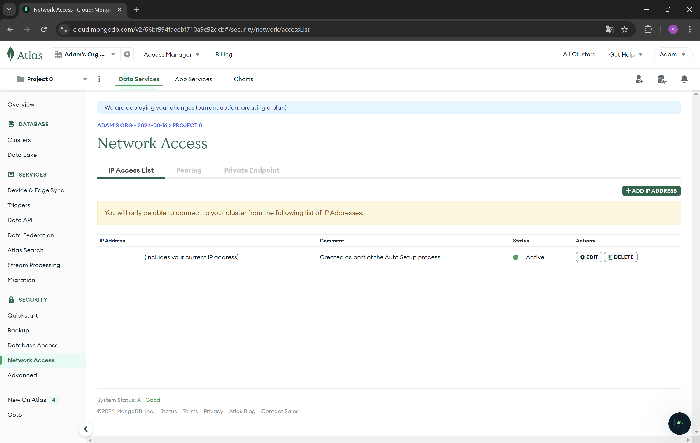
2. In the left settings bar, go to **Clusters** and press **Connect** button. Then from **Connect to your application** choose **Drivers**.
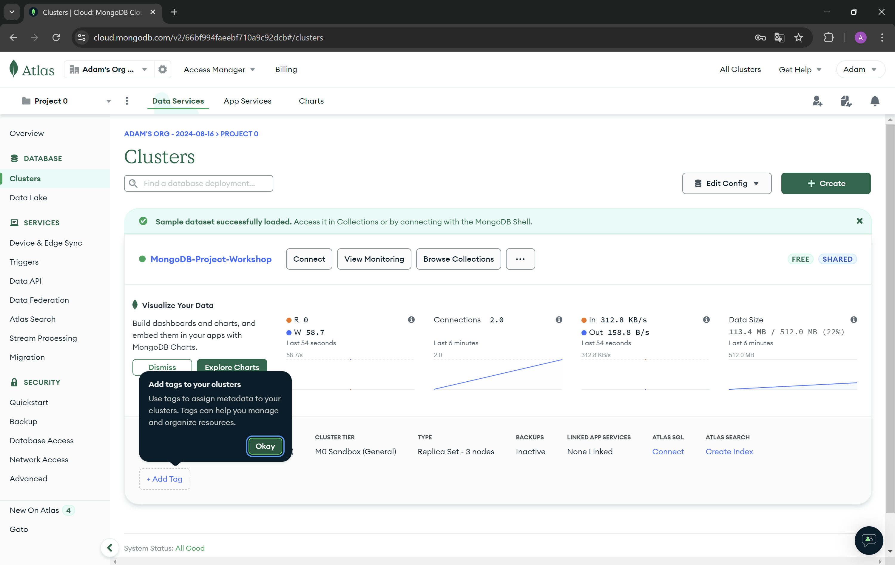
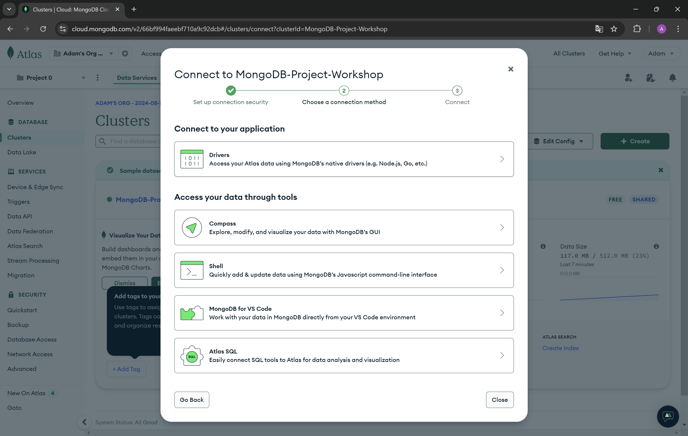
3. Now copy the connection string from step 3.
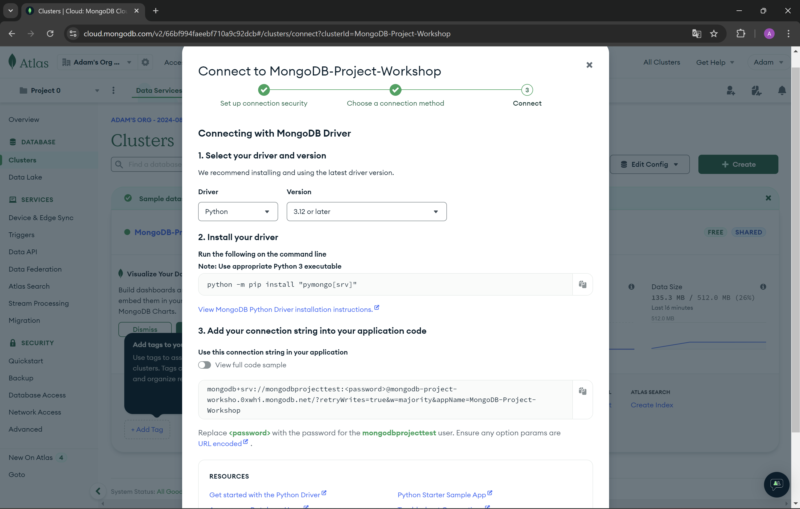
4. Create a new variable in the `.envrc` file in your project. Remember to replace the password placeholder with your database user's password in the connection string. `export MONGODB_URI="your_connection_string"`
5. Install plugin for mongodb on youd IDE.
    * PyCharm - *[tutorial](https://www.jetbrains.com/help/pycharm/mongodb.html#general_tab)*

    * Visual studio code - *[tutorial](https://code.visualstudio.com/docs/azure/mongodb)*
6. Connect to your database from python using beanie framework. 
To initialize **Beanie** require:
    * Motor as an async database engine.
    * List of your document models.

This approach isn't the way to do in production.


```python 
import os

from asyncio import run
from beanie import Document, init_beanie
from motor.motor_asyncio import AsyncIOMotorClient
from src.models import Task, User

async def database_init(document_models: list[Document], clear_database: False) -> None:
    # Create Motor client
    client = AsyncIOMotorClient(os.getenv("MONGODB_URI"))

    # Initialize beanie with the Sample document class and a database
    await init_beanie(
        database=client.workshop,
        document_models=,
        multiprocessing_mode=True,
    )
    # To drop database - for easier iterate and test.
    if clear_database:
        client.drop_database(name_or_database=client.workshop)

run(database_init(document_models=[Task, User]))
```
Function **`init_beanie`** also supports the parameters named:
* `allow_index_dropping: bool = False` - If you manage the indexes by yourself, when the parameter is set to`True`, indexes will be dropped.
* `recreate_views: bool = False` - If you want to use virtual views this parameter should be set to `True` *(aggregation pipelines stored in MongoDB that act as collections for reading operations)*.
* `multiprocessing_mode: bool = False` - If multiprocessing mode is set to `True` it will patch the motor client to use process's event loop.

*[Documentation for beanie initialization.](https://beanie-odm.dev/tutorial/initialization/)*


```python
from src.database_connection import database_init
from asyncio import run
from beanie import Document


class User(Document):
    name: str
    surname: str
    email: str


run(database_init(document_models=[User]))
```

Do you see Schema in Atlas?


Okey, but we don't have Document.

We use will use inheritance Document class same as BaseModel class.

```python
hot_adam = User(name="Adam", surname="Brzyzek", email="hotadam@gmail.com")
hot_adam
```

Output
```python
User(id=None, revision_id=None, name='Adam', surname='Brzyzek', email='hotadam@gmail.com')
```

We can see two additional attributes. `id` and `revision_id`.

`id` field reflects the unique _id field of the MongoDB document. Each object of the Document type has this field. The default type of this is PydanticObjectId.

`revision_id` field is for feature helps with concurrent operations.

We can use Base Model methods.


```python
hot_adam.model_dump()

{'id': None,
 'name': 'Adam',
 'surname': 'Brzyzek',
 'email': 'hotadam@gmail.com'}
```

Value of id field mean that we didn't insert to database yet.

To insert OUR Adam to database we need to use one of 5 options

* **insert** - basic method to insert Document
* **insert_many** - to insert one or more Documents
* **save** - insert, update current object of class Document to database
* create, insert_one - synonyms for insert 

Remember for each use await key word otherwise you will return couritne object & you will not insert object.

```python
hot_adam = User(name="Adam", surname="Brzyzek", email="hotadam@gmail.com")
```

```python
await hot_adam.save()
```
 or 

```python
await User.save(hot_adam)
```
 or

```python
await hot_adam.insert()
```

 or

```python
await User.insert(hot_adam)
```

```python
hot_adam.model_dump()
```

Output
```python 
{'id': '66cb3c4631b062a669d4357c',
 'name': 'Adam',
 'surname': 'Brzyzek',
 'email': 'nothotadam@gmail.com'}
```

How to get data?
* **find** - basic function to get 
  * **to_list**
  * **first_or_none**
  
* get - get document with id, without filtering
* find_one - get one document with filtering
* find_all - synonyms to find({})

Get all users in database

```python
users = await User.find().to_list()
```

Get first user in database

```python
result = await User.find().first_or_none()
```

Filters Adams

```python
adams = await User.find(User.name == "Adam").to_list()
```

### Exercise 1 - Create Document
* create document Task with name, description, priority(low, normal, urgent), Size(S, M, L), Status(Backlog, TODO, InProgress, OnHold, Review, Done)
* add one user & task

example of priority type

```python
from enum import IntEnum


class PriorityType(IntEnum):
    low = 1
    normal = 2
    urgent = 3
```


<details><summary><b><i>Solution</i></b></summary>

```python
from enum import IntEnum
from typing import Optional
from pydantic import BaseModel
import os

from asyncio import run
from beanie import Document


class PriorityType(IntEnum):
    low = 1
    normal = 2
    urgent = 3


class SizeType(IntEnum):
    S = 1
    M = 2
    L = 3


class StatusType(IntEnum):
    BACKLOG = 1
    TODO = 2
    InProgress = 3
    OnHold = 4
    Review = 5
    Done = 6


class Task(Document):
    name: str
    description: Optional[str] = None
    priority: Optional[PriorityType] = None
    size: Optional[SizeType] = None
    status: StatusType = StatusType.BACKLOG


class User(Document):
    name: str
    surname: str
    email: str
    address: Optional[Address] = None
    recently_tasks: Optional[Task] = None


run(database_init(document_models=[User, Task]))
```

</details>


You can always extend your Document with other classes like with pydantic classes.

For example we can add technical attribute if user is active and reuse it in the task too.


```python
from pydantic import BaseModel
from beanie import Document

class Active(BaseModel):
  active: bool = True


class User(Document, Active):
    name: str
    surname: str
    email: str

hot_adam = User(
    name="Adam",
    surname="Brzyzek",
    email="hotadam@gmail.com")

hot_adam.model_dump()
```

Output
```python
{'active': True,
 'id': None,
 'name': 'Adam',
 'surname': 'Brzyzek',
 'email': 'hotadam@gmail.com'}
```


In a relational database, you store each individual entity in its own table, and link them together through foreign keys. While MongoDB certainly supports references from one document to another, and even multi-document joins, it’s a mistake to use a document database the same way you use a relational one.


Embedded documents are an efficient and clean way to store related data, especially data that’s regularly accessed together. 

In general, when designing schemas for MongoDB, you should prefer embedding by default, and use references and application-side or database-side joins only when they’re worthwhile. The more often a given workload can retrieve a single document and have all the data it needs, the more consistently high-performance your application will be.

Link to documentation for MongoDB - Embedding MongoDB
[https://www.mongodb.com/resources/products/fundamentals/embedded-mongodb](https://www.mongodb.com/resources/products/fundamentals/embedded-mongodb)

Example Embedded Document - User Address

```python
from pydantic import BaseModel
from beanie import Document
from typing import Optional


class Address(BaseModel):
    country: str
    city: str
    street: str
    building_number: str
    zip_code: str


class User(Document):
    name: str
    surname: str
    email: str
    address: Optional[Address] = None

hot_adam = User(
    name="Adam",
    surname="Brzyzek",
    email="hotadam@gmail.com",
    address=Address(
        country="Poland",
        city="Gliwice",
        street="Jana Matejki 3",
        building_number="IBU Craft Beers",
        zip_code="44-100",
    ),
)
```

Our Favorite bar in Gliwice [https://maps.app.goo.gl/Jscx2wCmkE5cr2ke9](https://maps.app.goo.gl/Jscx2wCmkE5cr2ke9)


### Exercise 2 - create Embedded Document & extend Document
* add to User Document recently task added by user
* add extend tables with technical tables like active, create_data & update_data
* add one user & one task

<details><summary><b><i>Solution</i></b></summary>

```python
from pydantic import BaseModel
from beanie import Document
from typing import Optional
from datatime import datetime


class Date(BaseModel):
    create_date: datetime = datetime.now()
    update_date: datetime = datetime.now()


class Address(BaseModel):
    country: str
    city: str
    street: str
    building_number: str
    zip_code: str


class User(Document, Active, Date):
    name: str
    surname: str
    email: str
    address: Optional[Address] = None
    recently_tasks: Optional[Task] = None
```

</details>


## Relations
The document can contain links to other documents in their fields.

Example add link Task to User


```python
from asyncio import run
from pydantic import BaseModel
from beanie import Document
from typing import Optional


User = ForwardRef("User")

class Task(Document, Date, Active):
    name: str
    status: StatusType = StatusType.BACKLOG
    user: Link[User]

class User(Document, Date, Active):
    name: str
    surname: str
    email: str
    address: Optional[Address] = None
    recently_tasks: Optional[list[Task]] = []


run(database_init(document_models=[User, Task], clear_database=True))

hot_adam = User(name="Adam",surname="Brzyzek",email="hotbrzyzek@gmail.com")

await User.insert(hot_adam)

tasks = [
    Task(name="sail", user=hot_adam.id), # TODO: CHECK IF IT WORKING with hot_adam without id
    Task(name="drink beers", user=hot_adam.id),
]
await Task.insert_many(tasks)
user.recently_tasks = tasks
await user.save()
```


### Exercise 3 - link to other Document
* create document TaskLogStatus for log task status, 
  needs to have priority, size, status, date, link to user and task
* add task change status

<details><summary><b><i>Solution</i></b></summary>

```python
class TaskLogStatus(Document, Date):
    priority: Optional[PriorityType] = None
    size: Optional[SizeType] = None
    status: StatusType = StatusType.BACKLOG
    date: datetime = datetime.now()
    task: Link[Task]
    user: Link[User]
```

</details>


Updating & Deleting 
documentation: [https://beanie-odm.dev/tutorial/updating-%26-deleting/](https://beanie-odm.dev/tutorial/updating-%26-deleting/)

For update we have couple options
* save
* replace -  throws: - a ValueError if the document does not have an id yet, or - a beanie.exceptions.DocumentNotFound
* update, set, inc - can be performed on the result of a find or find_one query, or on a document that was returned from an earlier query.
* set
* upsert - to insert a document when no documents are matched against the search criteri

```python
user = await User.find(User.name == "Adam").first_or_none()
user = await user.set({User.name: "John"})
user.model_dump()
```
 
Output
```python
{'id': '66cbc95d9721746de2ec9ee6',
 'name': 'John',
 'surname': 'Brzyzek',
 'email': 'hotbrzyzek@gmail.com'}
```

To delete use method delete() XD

```python
toxic_workshop_instructor = await User.find_one(User.name == "Kamil")
await toxic_workshop_instructor.delete()
```

### Exercise 4 - update, delete

* Update task and user with 2 different method.
* Delete something or somebody. Do it 

<details><summary><b><i>Solution</i></b></summary>
Come on. Don't cheat XD
</details>
  

## important mentions 
* This returns a FindMany object, which can be used to access the results in different ways. To loop through the results, use a async for loop:

```python
async for result in User.find():
    print(result)
```

* When only a part of a document is required, projections can save a lot of database bandwidth and processing. 
  For simple projections we can just define a pydantic model with the required fields and pass it to project() method

```python
class UserBasicInfo(BaseModel):
    name: str
    surname: str


adams = await User.find(User.name == "Adam").project(UserBasicInfo).to_list()
adams
```

Output
```python
[]

```

* Settings
    add option from settings [https://beanie-odm.dev/tutorial/defining-a-document/](https://beanie-odm.dev/tutorial/defining-a-document/)
    

* We recommend to try interactive tutorial prepared at official website mongodb.com [https://www.mongodb.com/docs/manual/tutorial/getting-started/](https://www.mongodb.com/docs/manual/tutorial/getting-started/ )


* Good to check setting parameter is_root = True
[https://beanie-odm.dev/tutorial/inheritance/](https://beanie-odm.dev/tutorial/inheritance/)


# Data generators
To fill our database with data we need to generate dummy data. For that purpose has been used [Faker](https://github.com/xfxf/faker-python/blob/master/README.rst). Faker is a Python package that generates fake data for you.
List of Standard Providers you can find [here](https://faker.readthedocs.io/en/master/providers.html).

1. **Creation and initialization** of a Faker - dummy data generator. Below you can see the code for the init faker. Has been added the locale argument to return localized data from Poland. Seed value has been set to 2137, it will be helpful to compare the results of our queries later in the workshop.

```python
from faker.factory import Factory

fake = Factory.create(locale="pl_PL")
fake.seed(2137)
```

***Exercise 1*** - *Complete the generator that will return the number of User objects determined in advance. Address fields are missing.*

```python
from collections.abc import Generator

from faker.factory import Factory
from faker.generator import Generator as FakerGenerator

from models import Address, PriorityType, SizeType, StatusType, Task, User


def user_generator(fake: FakerGenerator, number_of_iterations: int) -> Generator[User]:
    for _ in range(number_of_iterations):
    address = Address()
    creation_date = fake.date_time_this_year(before_now=True, after_now=False)
    yield User(
        create_date=creation_date,
        update_date=creation_date,
        active=fake.pybool(truth_probability=90),
        name=fake.first_name(),
        surname=fake.last_name(),
        email=fake.ascii_email(),
        address=address
    )


fake = Factory.create(locale="pl_PL")
fake.seed(2137)
print(list(user_generator(fake=fake, number_of_iterations=10)))
```

<details><summary><b><i>Solution to Exercise 1</i></b></summary>

```python
from collections.abc import Generator

from faker.factory import Factory
from faker.generator import Generator as FakerGenerator

from models import Address, PriorityType, SizeType, StatusType, Task, User


def user_generator(fake: FakerGenerator, number_of_iterations: int) -> Generator[User]:
    for _ in range(number_of_iterations):
        address = Address(
            country="Poland",
            city=fake.city(),
            street=fake.street_name(),
            building_number=fake.building_number(),
            zip_code=fake.postcode(),
        )
        creation_date = fake.date_time_this_year(before_now=True, after_now=False)
        yield User(
            create_date=creation_date,
            update_date=creation_date,
            active=fake.pybool(truth_probability=90),
            name=fake.first_name(),
            surname=fake.last_name(),
            email=fake.ascii_email(),
            address=address
        )


fake = Factory.create(locale="pl_PL")
fake.seed(2137)
print(list(user_generator(fake=fake, number_of_iterations=10)))
```

</details>

***Exercise 2*** - *Using created generator in exercise 1 create async main function that will generate 50 users and save them to your database.*

```python
from asyncio import run

from database_connection import database_init


async def main():
    pass


run(main())
```

<details><summary><b><i>Solution to Exercise 2</i></b></summary>

```python
from asyncio import run

from database_connection import database_init


async def main():
    await database_init()
    fake = Factory.create(locale="pl_PL")
    fake.seed(2137)
    number_of_iterations = 50

    users = list(user_generator(fake=fake, number_of_iterations=number_of_iterations))
    await User.insert_many(users)


run(main())
```

</details>


***Exercise 3*** - *Create a generator that will return the number of Tasks for each User.*

```python
def task_generator(
    fake: FakerGenerator, users: list[User], number_of_tasks_for_user: int
) -> Generator[Task]:
    pass
```


<details><summary><b><i>Solution to Exercise 3</i></b></summary>

```python
from datetime import date


def task_generator(
    fake: FakerGenerator, users: list[User], number_of_tasks_for_user: int
) -> Generator[Task]:
    for user in users:
        for _ in range(number_of_tasks_for_user):
            create_date = user.create_date + fake.time_delta(
                end_datetime=date(2026, 1, 1)
            )
            yield Task(
                create_date=create_date,
                update_date=create_date,
                active=fake.pybool(truth_probability=90),
                name=fake.pystr(prefix="task_", max_chars=10),
                description=fake.pystr(prefix="description_", max_chars=10),
                priority=fake.enum(PriorityType),
                size=fake.enum(SizeType),
                status=fake.enum(StatusType),
                user=user,
            )
```

</details>

***Exercise 4*** - *Update the main function for generation 10 tasks for each created User and save them to your database.*

```python
from beanie.operators import In


async def main():
    pass


run(main())
```


<details><summary><b><i>Solution to Exercise 4</i></b></summary>

```python
from beanie.operators import In

async def main():
    await database_init()
    fake = Factory.create(locale="pl_PL")
    fake.seed(2137)
    number_of_iterations = 50

    users = list(user_generator(fake=fake, number_of_iterations=number_of_iterations))
    users = await User.insert_many(users)
    users = await User.find_many(
        In(User.id, users.inserted_ids),
    ).to_list()

    tasks = list(task_generator(fake=fake, users=users, number_of_tasks_for_user=10))
    await Task.insert_many(tasks)


run(main())
```

</details>


***Exercise 5*** - *Create a function that updates all users and saves their last recent tasks. Also update main function to execute that function and saves last 3 tasks for each user.*

```python
from pymongo import DESCENDING


async def user_update_recent_tasks(users: list[User], number_of_tasks: int):
    pass


async def main():
    pass


run(main())
```

<details><summary><b><i>Solution to Exercise 5</i></b></summary>

```python
from pymongo import DESCENDING


async def user_update_recent_tasks(users: list[User], number_of_tasks: int):
    for user in users:
        tasks = (
            await Task.find_many(Task.user.id == PydanticObjectId(user.id))
            .sort((Task.create_date, DESCENDING))
            .to_list(number_of_tasks)
        )
        user.recently_tasks = tasks
        await user.save()


async def main():
    await database_init()
    fake = Factory.create(locale="pl_PL")
    fake.seed(2137)
    number_of_iterations = 50

    users = list(user_generator(fake=fake, number_of_iterations=number_of_iterations))
    users = await User.insert_many(users)
    users = await User.find_many(
        In(User.id, users.inserted_ids),
    ).to_list()

    tasks = list(task_generator(fake=fake, users=users, number_of_tasks_for_user=10))
    tasks = await Task.insert_many(tasks)
    tasks = await Task.find_many(
        In(Task.id, tasks.inserted_ids),
    ).to_list()
    await user_update_recent_tasks(users=users, number_of_tasks=3)
```

</details>

# Simple queries in MongoDb Atlas 

In MongoDb Atlas you can browse data from your database. On the page, you need to select Clusters from the options on the left bar and then press button **`Browse Collection`**. From this level of the page you can see the **filter field** used for query data. You can use all the MongoDB [query operators](https://www.mongodb.com/docs/manual/reference/operator/query/) except the *\$text* and *\$expr* operators.

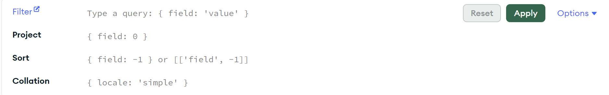
# Cheat sheet [MongoDb Atlas filter](https://www.mongodb.com/docs/compass/current/query/filter/).


Logical:
1. **AND**: `{ $and: [ { field: value, field: value } ] }`
2. **OR**: `{ $or: [ { field: value }, { field: value } ] }`
3. **NOT**: `{ field: { $not: { $eq: value } } }`
4. **NOR**: `{ $nor: [ { field: value }, { field: value } ] }`

Comparison:
1. **Greater than**: `{ field: { $gt: value } }`
2. **Greater than or equal**: `{ field: { $gte: value } }`
3. **Less than**: `{ field: { $lt: value } }`
4. **Less than or equal**: `{ field: { $lte: value } }`
5. **In an array**: `{ field: { $in: [value1, value2, ... valueN ] } }`
6. **Not in an array**: `{ field: { $nin: [ value1, value2 ... valueN ] } }`
7. **Equal to**: `{ field: { $eq: value } }`
8. **Not equal to**: `{ field: { $ne: value } }`
 

Embedded Field: `{ "field.embedded_field": value }`
Exists: `{ field: { $exists: boolean } }`
Type: `{ field: { $type: BSON type } }`
Any of the listed types: `{ field: { $type: [ BSON type1 , BSON type2, ... BSON typeN ] } }`


*Let's create some queries in MongoDb Altas.*

***Exercise 1*** - Search for user with id. 

*`HINT`: BSON object to contain id in mongo db is `ObjectId()`.*

<details><summary><b><i>Solution to Exercise 1.</i></b></summary>

```JavaScript
{_id: ObjectId("66cb3940ad0f1a3e611edd3b")}
```
</details>


***Exercise 2*** - Search for user which surname is `Olko`.

<details><summary><b><i>Solution to Exercise 2.</i></b></summary>

```JavaScript
{surname: "Olko"}
```
</details>


***Exercise 3*** - Search for users whose city address is `Warszawa`.

<details><summary><b><i>Solution to Exercise 3.</i></b></summary>

```JavaScript
{"address.city": "Warszawa"}
```
</details>


***Exercise 4*** - Search for users whose name is `Krzysztof`, `Nicole` or `Angelika`.

<details><summary><b><i>Solution to Exercise 4.</i></b></summary>

```JavaScript
{"name": {$in: ["Krzysztof", "Nicole", "Angelika"]}}
```
```JavaScript
{$or: [{"name": "Krzysztof"}, {"name": "Nicole"}, {"name": "Angelika"}]}
```
</details>


***Exercise 5*** - Search for tasks whose priority is `low` or status is `Review`. 

*`HINT`: Priority int enum for `low is 1` and status int enum for `Review is 5`.*

<details><summary><b><i>Solution to Exercise 5.</i></b></summary>

```JavaScript
{$or: [{priority: 1}, {status: 5}]}
```
</details>


***Exercise 6*** - Search for all active tasks whose creation date is after `2024-07-18`.

*`HINT`: BSON object for date in mongo db is `ISODate()`.*

<details><summary><b><i>Solution to Exercise 6.</i></b></summary>

```JavaScript
{active: true, create_date: {$gt: ISODate("2024-07-18")}}
```
</details>


### Exercise X - create crud for User, Task & TaskLogStatus

create functions, for example
* get task for specific user id
* get all tasks from active users
* get created logs in date range
* create User, Task & TaskLogStatus
* delete/deactivate user, task & TaskLogStatus

<details><summary><b><i>Solution</i></b></summary>
Come on. Again?! XD
</details>


# Resources

* Documentation for MongDB [https://www.mongodb.com/docs/](https://www.mongodb.com/docs/)

* Documentation Beanie [https://beanie-odm.dev/](https://beanie-odm.dev/)

* Please join official Beanie Discord Channel [https://discord.gg/AwwTrbCASP](https://discord.gg/AwwTrbCASP)

* Official channel MongoDB - we recommend   
  * Jumpstart [link](https://www.youtube.com/watch?v=RGfFpQF0NpE&list=PL4RCxklHWZ9v2lcat4oEVGQhZg6r4IQGV )
  * Schema Design [link](https://www.youtube.com/watch?v=J1RRM53I3kc&list=PL4RCxklHWZ9tB00Sh2nMftVIBaVG_-bmY)
* Code with Mark Smith on official channel 
* Presentation on PyCon by Mark Smith - Everything You Know About MongoDB is Wrong! [link](https://www.youtube.com/watch?v=ISfzI7LTDL4) 

## [OPTIONAL INFO] Mongoose [https://www.mongodb.com/docs/mongodb-shell/](https://www.mongodb.com/docs/mongodb-shell/)

The MongoDB Shell, mongosh, is a JavaScript and Node.js REPL environment for interacting with MongoDB deployments in Atlas  , locally, or on another remote host. Use the MongoDB Shell to test queries and interact with the data in your MongoDB database.

If you would like more native approach in MongoDB