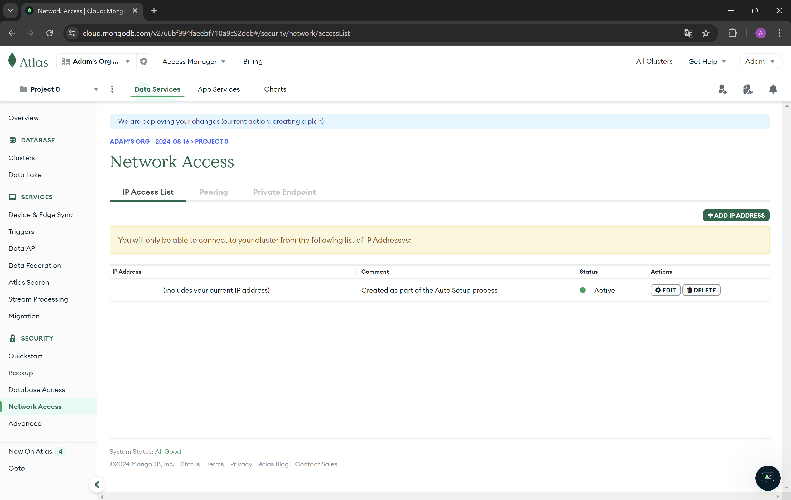
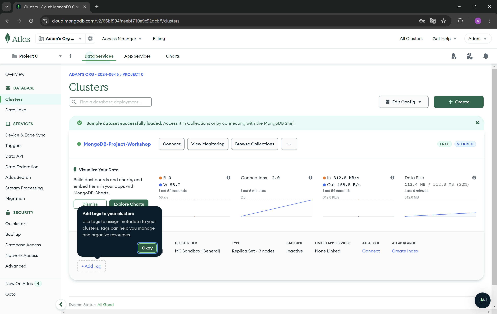
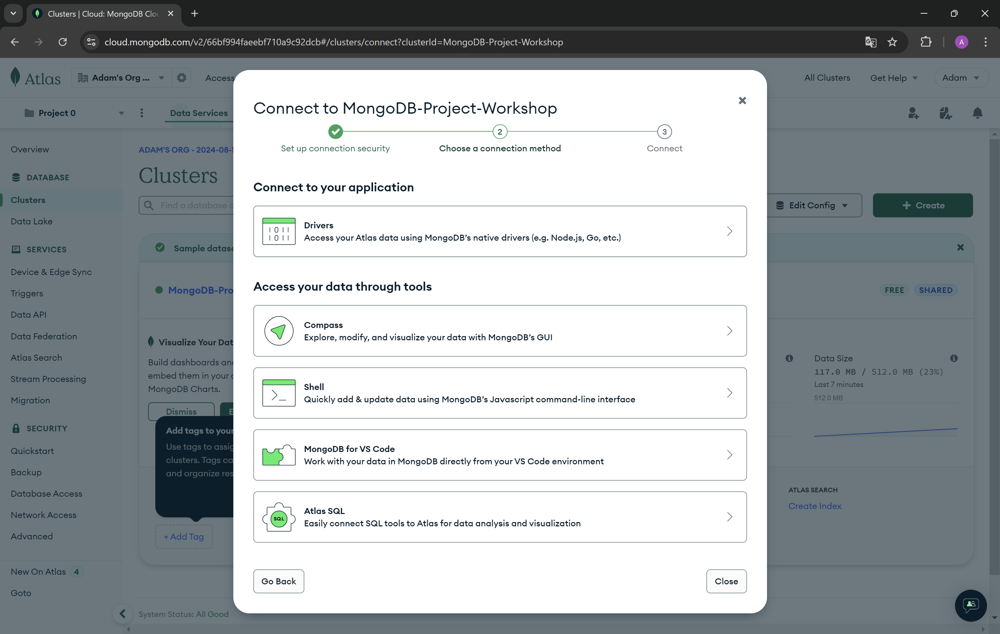
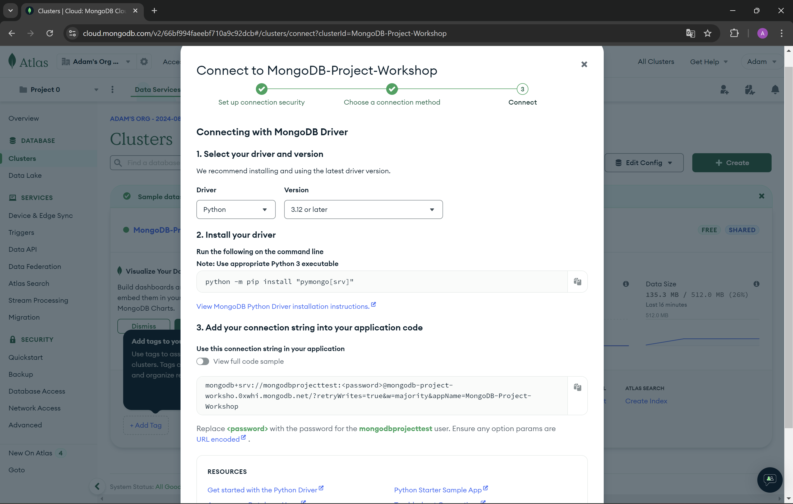

# Connect to your mongo database.

1. In the left settings bar, go to **Network Access** and check if your IP address has been added successfully. You should see a green dot in the status column. If your IP address is not added, you will not be able to connect to the database from your device.

2. In the left settings bar, go to **Clusters** and press **Connect** button. Then from **Connect to your application** choose **Drivers**.


3. Now copy the connection string from step 3.

4. Create a new variable in the `.envrc` file in your project. Remember to replace the password placeholder with your database user's password in the connection string. `export MONGODB_URI="your_connection_string"`
5. Install plugin for mongodb on youd IDE.
    * PyCharm - [tutorial](https://www.jetbrains.com/help/pycharm/mongodb.html#general_tab)

    * Visual studio code - [tutorial](https://code.visualstudio.com/docs/azure/mongodb)
6. Connect to your database from python using beanie framework. 
To initilaize **Beanie** requiere:
    * Motor as an async database engine.
    * List of your document models.

```python 
from config import CONNECTION_STRING
from src.models import User

async def init():
    # Create Motor client
    client = AsyncIOMotorClient(CONNECTION_STRING)
 
    # Initialize beanie with the Sample document class and a database
    await init_beanie(database=client.workshop, document_models=[User])
```
Function **`init_beanie`** also supports the parameters named:
* `allow_index_dropping: bool = False` - If you manage the indexes by yourself, when the parameter is set to`True`, indexes will be dropped.
* `recreate_views: bool = False` - If you want to use virtual views this parameter should be set to `True` *(aggregation pipelines stored in MongoDB that act as collections for reading operations)*.
* `multiprocessing_mode: bool = False` - If multiprocessing mode is set to `True` it will patch the motor client to use process's event loop.

*[Documentation for beanie initialization.](https://beanie-odm.dev/tutorial/initialization/)*
