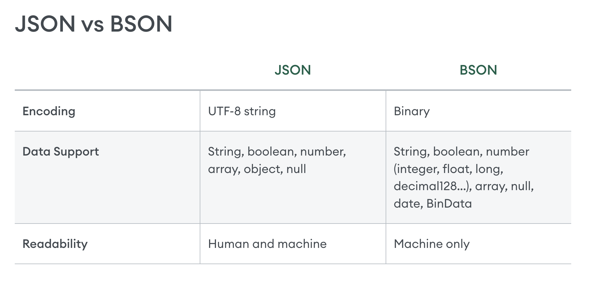

## data structure 
we recommend to try interactive tutorial prepared at official website mongodb.com
<!-- https://www.mongodb.com/docs/manual/tutorial/getting-started/ -->

## MongoDB as a Document Database

In MongoDB, databases hold one or more collections of documents.

Collections are analogous to tables in relational databases.


Picture from mongodb.com

MongoDB stores data records as documents (specifically BSON documents) which are gathered together in collections.


JSON 
https://www.mongodb.com/resources/basics/json-and-bson

BSON specification
https://bsonspec.org/

Today, JSON shows up in many different cases:
 
* APIs
* Configuration files
* Log messages
* Database storage

However, there are several issues that make JSON less than ideal for usage inside of a database.

JSON only supports a limited number of basic data types. Most notably, JSON lacks support for datetime and binary data.

JSON objects and properties don't have fixed length which makes traversal slower.

JSON does not provide metadata and type information, taking longer to retrieve documents.

To make MongoDB JSON-first but still high-performance and general purpose, BSON was invented to bridge the gap: a binary representation to store data as JSON documents, optimized for speed, space, and efficiency. It's not dissimilar from other binary interchange formats like Protocol Buffers, or Thrift, in terms of approach.

* security not readable for people - we have tool for read it
* faster
* smaller
* contain more information


## pydantic + beanie = ❤️

To create Document in Collections we need to use the basic class in Beanie 
The basic class in Beanie is Document class to create collections of Document

After inspect of the Beanie base class Document
we can see it's inherent from pydantic Base Model 

```python
import inspect
from beanie import Document
from pydantic import BaseModel


inspect.getmro(Document)
```

```
(beanie.odm.documents.Document,
 lazy_model.parser.new.LazyModel,
 pydantic.main.BaseModel,
 beanie.odm.interfaces.setters.SettersInterface,
 beanie.odm.interfaces.inheritance.InheritanceInterface,
 beanie.odm.interfaces.find.FindInterface,
 beanie.odm.interfaces.aggregate.AggregateInterface,
 beanie.odm.interfaces.getters.OtherGettersInterface,
 object)
```

pydantic + beanie = ❤️

### How use Document

when we would like to create application 

we want to create for users

that why our first class will be user

Example in User class in pydantic

```python 
from pydantic import BaseModel


class User(BaseModel):
    name: str
    surname: str
    email: str
```

Example in User class in beanie

```python
from beanie import Document


class User(Document):
    name: str
    surname: str
    email: str
```


if you run code above, you will see error message 'CollectionWasNotInitialized'.
To Initialized collection need to use init_beanie function.

#

```python 
import os

from beanie import Document, init_beanie
from motor.motor_asyncio import AsyncIOMotorClient

class User(Document):
    name: str
    surname: str
    email: str


client = AsyncIOMotorClient(os.getenv("MONGODB_URI"))
await init_beanie(
    database=client.workshop,
    document_models=[User],
    multiprocessing_mode=True,
)

```

Okey, but we don't have user.

We use will use inheritance Document class same as BaseModel class.

```python
hot_adam = User(name="Adam", surname="Brzyzek", email="hotadam@gmail.com")
hot_adam

# User(id=None, revision_id=None, name='Adam', surname='Brzyzek', email='hotadam@gmail.com')
```
We can see two additional attributes. 'id' and 'revision_id'.

TODO: explain it

we can use Base Model methods


```python
hot_adam.model_dump()

{'id': None,
 'name': 'Adam',
 'surname': 'Brzyzek',
 'email': 'hotadam@gmail.com'}
```

value non id mean that we didn't insert to database yet.

to insert OUR Adam to database we need to use one of 5 options

* **insert** - basic method to insert Document
* **insert_many** - to insert one or more Documents
* **save** - insert, update current object of class Document to database
* create, insert_one - synonyms for insert 


Remember from each use await key word otherwise you will return couritne object & you will not insert object.

```python
hot_adam = User(name="Adam", surname="Brzyzek", email="hotadam@gmail.com")


# User(id=None, revision_id=None, name='Adam', surname='Brzyzek', email='hotadam@gmail.com')
```

```python
await hot_adam.save()
```

```python
await User.save(hot_adam)
```


```python
await hot_adam.insert()
```

```python
await User.insert(hot_adam)
```

```python
hot_adam.model_dump()

{'id': '66cb3c4631b062a669d4357c',
 'name': 'Adam',
 'surname': 'Brzyzek',
 'email': 'nothotadam@gmail.com'}
```


now to get data
* **find** - basic function to get 
  * **to_list**
  * **first_or_none**
  
* get - get document with id, without filtering
* find_one - get one document with fitlering
* find_all - synonyms to find({})

get all users in database

```python
users = await User.find().to_list()
```

get all users in database
```python
result = await User.find().project(BaseInformation).first_or_none()
```

filters Adams

```python
adams = await User.find(User.name == "Adam").project(UserBasicInfo).to_list()
```

### Exercise 1 - create Document
* create document Task with name, description, priority(low, normal, urgent), Size(S, M, L), Status(Backlog, TODO, InProgress, OnHold, Review, Done)
* add one user & task

Solution

Embedded Document Example


### Exercise 2 - create Embedded Document
* add to User Document recently task added by user
* hints use save


Solution

clear database
Active Example


### Exercise 3 - extend Document
* add extend tables with technical tables like active, create_data & update_data

Solution

clear database
link Task example


### Exercise 4 - link to other Document
* create document TaskLogStatus for log task status, 
  needs to have priority, size, status, date, link to user and task

Solution

update, delete example

### Exercise 5 - update, delete

Solution
  
## important mentions 
* This returns a FindMany object, which can be used to access the results in different ways. To loop through the results, use a async for loop:

```python
async for result in User.find():
    print(result)
```
* When only a part of a document is required, projections can save a lot of database bandwidth and processing. 
  For simple projections we can just define a pydantic model with the required fields and pass it to project() method

```python
class UserBasicInfo(BaseModel):
    name: str
    surname: str


adams = await User.find(User.name == "Adam").project(UserBasicInfo).to_list()
```

* settings
# add option from settings
# https://beanie-odm.dev/tutorial/defining-a-document/
# Settings
# The inner class Settings is used to configure:
# MongoDB collection name
# Indexes
# Encoders
# Use of revision_id
# Use of cache
# Use of state management
# Validation on save
# Configure if nulls should be saved to the database
# Configure nesting depth for linked documents on the fetch operation


# tips about configuration

* ids in mongodb 


<!-- https://www.mongodb.com/docs/manual/introduction/ -->