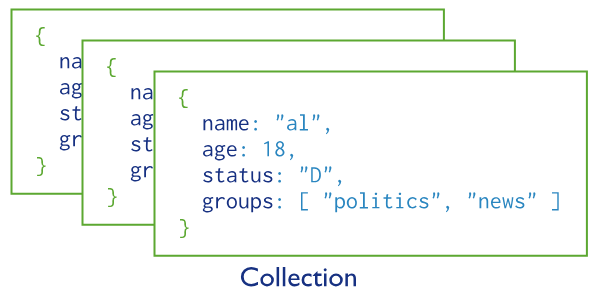
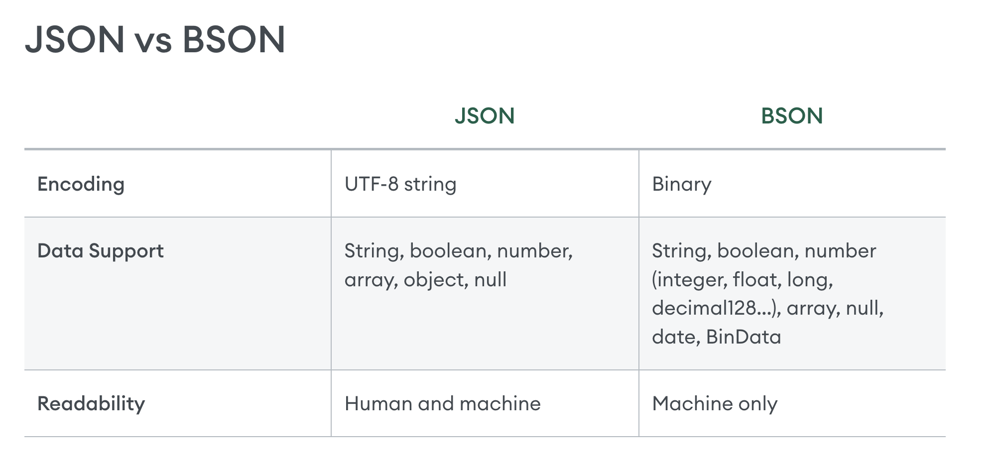

## data structure 
we recommend to try interactive tutorial prepared at official website mongodb.com
<!-- https://www.mongodb.com/docs/manual/tutorial/getting-started/ -->

## MongoDB as a Document Database

In MongoDB, databases hold one or more collections of documents.

Collections are analogous to tables in relational databases.

Picture from mongodb.com

MongoDB stores data records as documents (specifically BSON documents) which are gathered together in collections.

JSON 
https://www.mongodb.com/resources/basics/json-and-bson

BSON specification
https://bsonspec.org/

Today, JSON shows up in many different cases:

APIs
Configuration files
Log messages
Database storage

However, there are several issues that make JSON less than ideal for usage inside of a database.

JSON only supports a limited number of basic data types. Most notably, JSON lacks support for datetime and binary data.

JSON objects and properties don't have fixed length which makes traversal slower.

JSON does not provide metadata and type information, taking longer to retrieve documents.

To make MongoDB JSON-first but still high-performance and general purpose, BSON was invented to bridge the gap: a binary representation to store data as JSON documents, optimized for speed, space, and efficiency. It's not dissimilar from other binary interchange formats like Protocol Buffers, or Thrift, in terms of approach.

# add option from settings
# in beanie
# https://beanie-odm.dev/tutorial/defining-a-document/
# Settings
# The inner class Settings is used to configure:
# MongoDB collection name
# Indexes
# Encoders
# Use of revision_id
# Use of cache
# Use of state management
# Validation on save
# Configure if nulls should be saved to the database
# Configure nesting depth for linked documents on the fetch operation

# tips about configuration

<!-- https://www.mongodb.com/docs/manual/introduction/ -->