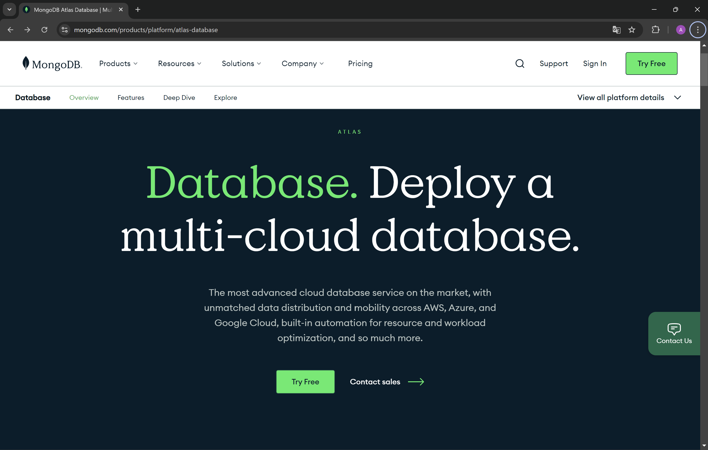
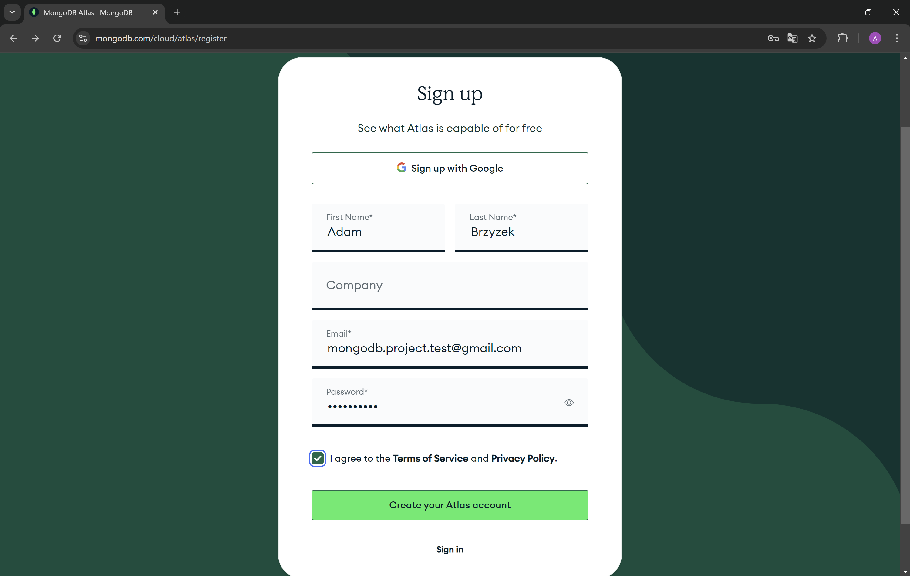
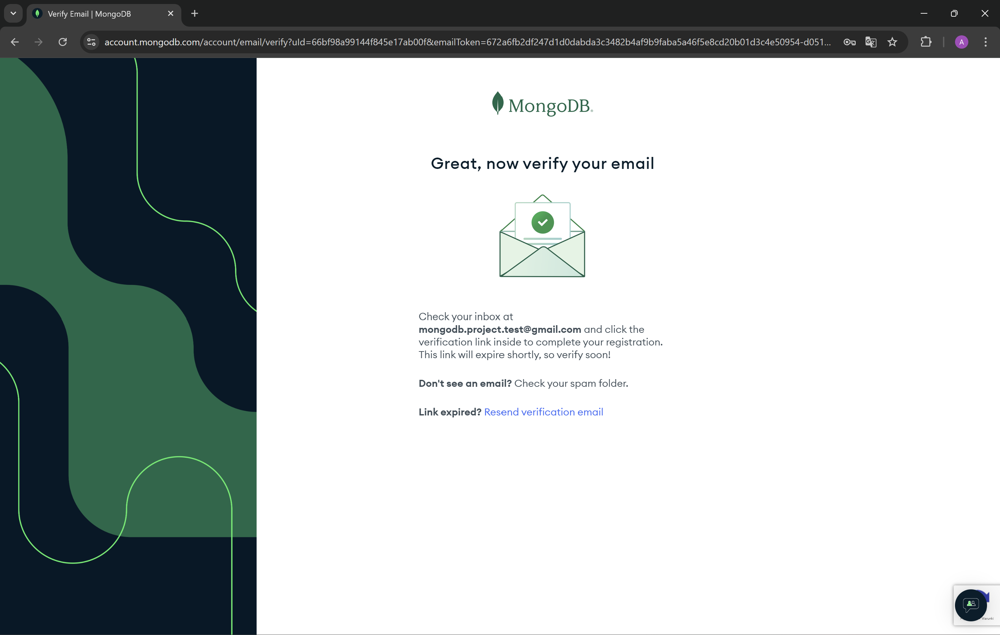
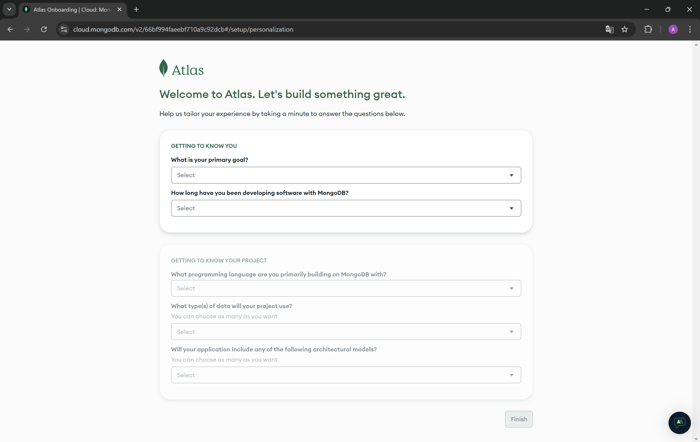
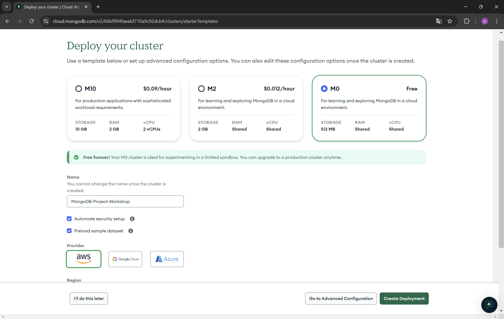
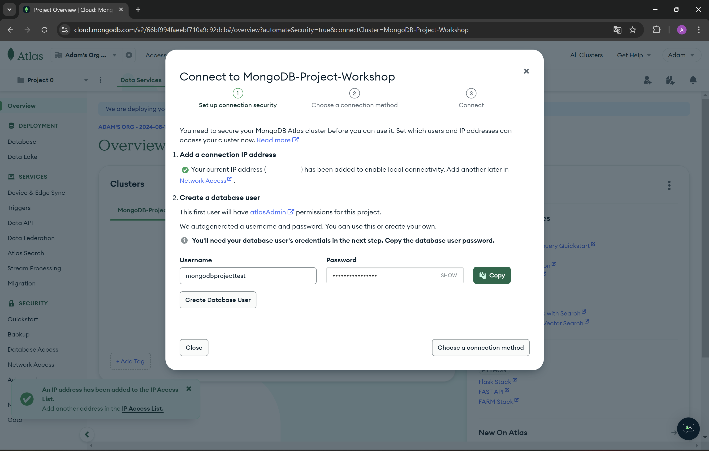

# Tutorial for creating an account in MongoDb Atlas.
1. Go to the [MongoDb website](https://www.mongodb.com/products/platform/atlas-database) and press the button **Try Free**.

2. Fill your informations and agree for Terms of Service and Privacy Policy. Press **Create your Atlas account** button. You can also use your Google account to create the account.

3. Now you need to verify your email address.

4. Complete the answers to the questions below.

5. Choose M0 tier plan created for learning and exploring MongoDB in a cloud environment. As you can see, you have 512 MB of your storage on cloud provider for free. Enter a name for your cluster. If you do not want to receive sample data, you can uncheck the Preload sample data set option.

6. Now create a user for your database.

7. In the left settings bar, go to Network Access and check if your IP address has been added successfully. You should see a green dot in the status column. If your IP address is not added, you will not be able to connect to the database from your device.

