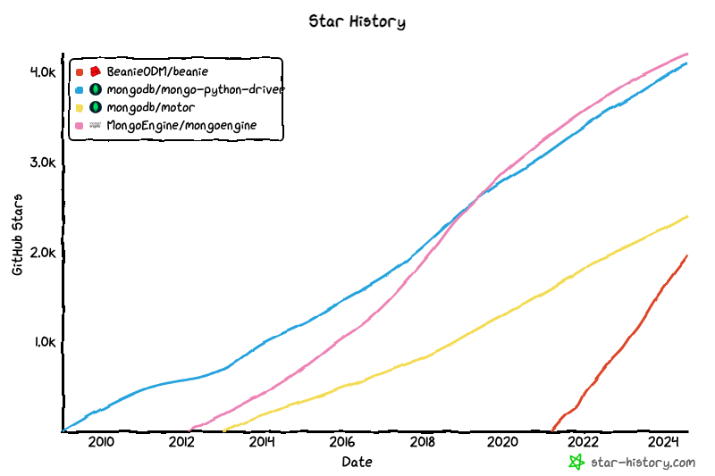
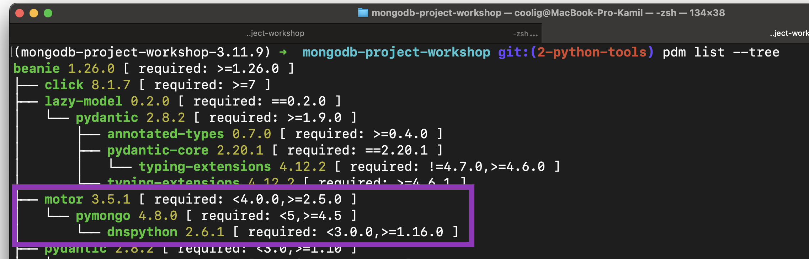

## Comparison Python tools for MongoDB 

To find the ideal Python tool for MongoDB, we focused on specific criteria: seamless integration with Pydantic and FastAPI, a robust ODM, and support for asynchronous operations with FastAPI.

### Integration with **Pydantic** & **FastAPI**

**Pydantic: Powerful Data Validation Made Easy**

* Powered by type hints — with Pydantic, schema validation and serialization are controlled by type annotations; less to learn, less code to write, and integration with your IDE and static analysis tools.
* Speed — Pydantic's core validation logic is written in Rust. As a result, Pydantic is among the fastest data validation libraries for Python.
* JSON Schema — Pydantic models can emit JSON Schema, allowing for easy integration with other tools. 
  
[https://docs.pydantic.dev/latest/](https://docs.pydantic.dev/latest/)

**FastAPI: Modern, Fast Web Framework for building APIs**

* Fast: Very high performance, on par with NodeJS and Go (thanks to Starlette and Pydantic).
* Fast to code: Increase the speed to develop features.
* Intuitive: Great editor support. Completion everywhere. Less time debugging.
* Easy: Designed to be easy to use and learn. Less time reading docs.
* Short: Minimize code duplication. Multiple features from each parameter declaration. Fewer bugs.
* Robust: Get production-ready code. With automatic interactive documentation.
* Standards-based: Based on (and fully compatible with) the open standards for APIs: OpenAPI (previously known as Swagger) and JSON Schema.
  

[https://fastapi.tiangolo.com/](https://fastapi.tiangolo.com/)

### Use **asynchronouse option** with FastAPI
 For better performance & scalability. 
 
 But remember when you need to use async framework...

We found 4 potential candidates to use them. 

* pymongo [https://github.com/mongodb/mongo-python-driver](https://github.com/mongodb/mongo-python-driver)
  
* motor [https://github.com/mongodb/motor](https://github.com/mongodb/motor)
  
* mongoengine [https://github.com/MongoEngine/mongoengine](https://github.com/MongoEngine/mongoengine)
  
* beanie [https://github.com/BeanieODM/beanie](https://github.com/BeanieODM/beanie)

### Star history comparison with [https://star-history.com/blog/how-to-use-github-star-history](https://star-history.com/blog/how-to-use-github-star-history)

**PyMongo** and **MongoEngine** out - no asynchronous support.
**Motor** and **Beanie** are Python drivers support asynchronous. 

**driver vs ODM**
**Driver** give basic connection & basic options.
**Document-Object Mapper** (think ORM Object–Relational Mapping, but for document databases).

| Feature                | **Driver**                        | **ODM**                            |
| ---------------------- | --------------------------------- | ---------------------------------- |
| **Level**              | Low-level                         | High-level                         |
| **Control**            | More control, manual queries      | Less control, auto-mapped objects  |
| **Abstraction**        | Minimal                           | High, object-oriented              |
| **Schema Enforcement** | None, or manual                   | Schema defined in code             |
| **Best For**           | Performance, fine-grained control | Rapid development, maintainability |

| tool | type  | support Pydantic | support async |
| ------------ |   :---:    |   :---:    |   :---:    |
| PyMongo | driver | ❌  | ❌ |
| Mongo Engine | ODM  |  ❌  | ❌ |
| Motor | driver  |  ❌  | ✅ |
| Beanie | ODM  |  ✅  | ✅ |

For enter easier in MongoDB world & hype about tool we decide to use Beanie.

**Beanie ODM** - object-document mapper for MongoDB. Data models are based on Pydantic. 

Beanie wraps Motor, Motor wraps PyMongo. The most popular python drivers.

## Reference
* If you want learn more about async in Python. Recommend course from Lukasz Langa [https://www.youtube.com/watch?v=Xbl7XjFYsN4&list=PLhNSoGM2ik6SIkVGXWBwerucXjgP1rHmB](https://www.youtube.com/watch?v=Xbl7XjFYsN4&list=PLhNSoGM2ik6SIkVGXWBwerucXjgP1rHmB)

* Does MongoEngine support asynchronous drivers (Motor, TxMongo)? [https://mongoengine-odm.readthedocs.io/faq.html?highlight=async](https://mongoengine-odm.readthedocs.io/faq.html?highlight=async)

* Showing wrapping of beanie motor [https://github.com/search?q=repo%3ABeanieODM%2Fbeanie%20motor&type=code](https://github.com/search?q=repo%3ABeanieODM%2Fbeanie%20motor&type=code)
  
* Showing wrapping of motor pymongo
[https://github.com/search?q=repo%3Amongodb%2Fmotor%20pymongo&type=code](https://github.com/search?q=repo%3Amongodb%2Fmotor%20pymongo&type=code)

* Link for generate star history graph [[Star History Chart](https://api.star-history.com/svg?repos=BeanieODM/beanie,mongodb/mongo-python-driver,mongodb/motor,MongoEngine/mongoengine&type=Date)](https://star-history.com/#BeanieODM/beanie&mongodb/mongo-python-driver&mongodb/motor&MongoEngine/mongoengine&Date) 
