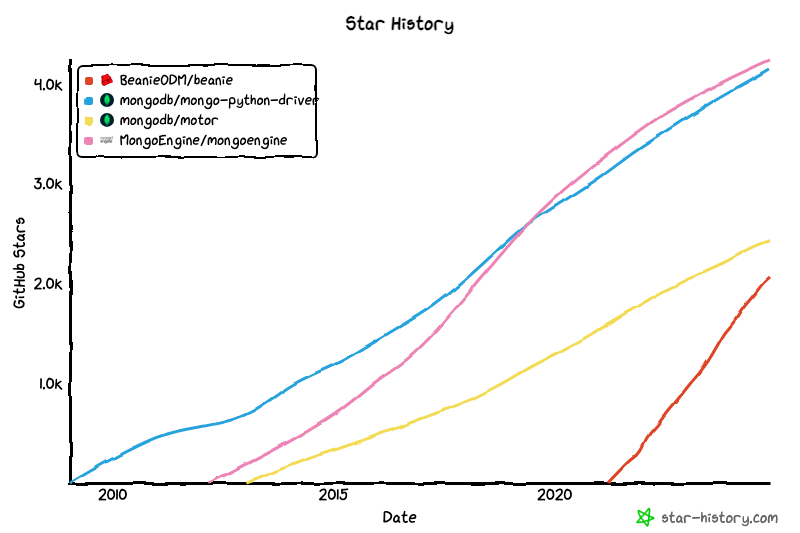

## Comparison solution for using Python with MongoDB 

We want to have integration with Pydantic models, bcs we like Pydantic & FastAPI is based on it.

We would like to try asynchronous option with FastAPI.

We would like to use async framework for better performance & scalability.

But remember when you need to use async framework.

We found 4 potential candidates to use them. 

* pymongo [https://github.com/mongodb/mongo-python-driver](https://github.com/mongodb/mongo-python-driver)
  
* motor [https://github.com/mongodb/motor](https://github.com/mongodb/motor)
  
* mongoengine [https://github.com/MongoEngine/mongoengine](https://github.com/MongoEngine/mongoengine)
  
* beanie [https://github.com/BeanieODM/beanie](https://github.com/BeanieODM/beanie)

### Star history comparison with [https://star-history.com/blog/how-to-use-github-star-history](https://star-history.com/blog/how-to-use-github-star-history)

**PyMongo** and **Motor** are Python drivers for asynchronous.

MongoEngine and Beanie are **ODMs**.

**Document-Object Mapper** (think ORM Object–Relational Mapping, but for document databases).

**PyMongo** and **MongoEngine** out - no asynchronous support.

For enter easier in MongoDB world & hype about tool we decide to use Beanie.

**Beanie ODM** - object-document mapper for MongoDB. Data models are based on Pydantic. 

<!-- how many of use like Pydantic -->

Pydantic for the win.

Beanie wraps Motor, Motor wraps PyMongo. The most popular python drivers.

## Reference
* Does MongoEngine support asynchronous drivers (Motor, TxMongo)? [https://mongoengine-odm.readthedocs.io/faq.html?highlight=async](https://mongoengine-odm.readthedocs.io/faq.html?highlight=async)

* Showing wrapping of beanie motor [https://github.com/search?q=repo%3ABeanieODM%2Fbeanie%20motor&type=code](https://github.com/search?q=repo%3ABeanieODM%2Fbeanie%20motor&type=code)
  
* Showing wrapping of motor pymongo
[https://github.com/search?q=repo%3Amongodb%2Fmotor%20pymongo&type=code](https://github.com/search?q=repo%3Amongodb%2Fmotor%20pymongo&type=code)

* Link for generate star history graph [[Star History Chart](https://api.star-history.com/svg?repos=BeanieODM/beanie,mongodb/mongo-python-driver,mongodb/motor,MongoEngine/mongoengine&type=Date)](https://star-history.com/#BeanieODM/beanie&mongodb/mongo-python-driver&mongodb/motor&MongoEngine/mongoengine&Date) 
