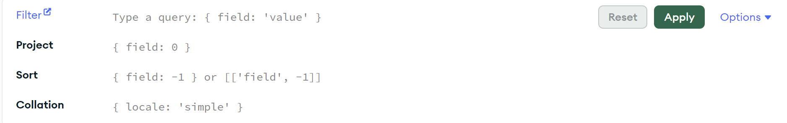

# Simple queries in MongoDB Atlas 

In MongoDB Atlas you can browse data from your database. On the page, you need to select Clusters from the options on the left bar and then press button **`Browse Collection`**. From this level of the page you can see the **filter field** used for query data. You can use all the MongoDB [query operators](https://www.mongodb.com/docs/manual/reference/operator/query/) except the *\$text* and *\$expr* operators.


# Cheat sheet [MongoDB Atlas filter](https://www.mongodb.com/docs/compass/current/query/filter/).


Logical:
1. **AND**: `{ $and: [ { field: value, field: value } ] }`
2. **OR**: `{ $or: [ { field: value }, { field: value } ] }`
3. **NOT**: `{ field: { $not: { $eq: value } } }`
4. **NOR**: `{ $nor: [ { field: value }, { field: value } ] }`

Comparison:
1. **Greater than**: `{ field: { $gt: value } }`
2. **Greater than or equal**: `{ field: { $gte: value } }`
3. **Less than**: `{ field: { $lt: value } }`
4. **Less than or equal**: `{ field: { $lte: value } }`
5. **In an array**: `{ field: { $in: [value1, value2, ... valueN ] } }`
6. **Not in an array**: `{ field: { $nin: [ value1, value2 ... valueN ] } }`
7. **Equal to**: `{ field: { $eq: value } }`
8. **Not equal to**: `{ field: { $ne: value } }`
 

Embedded Field: `{ "field.embedded_field": value }`
Exists: `{ field: { $exists: boolean } }`
Type: `{ field: { $type: BSON type } }`
Any of the listed types: `{ field: { $type: [ BSON type1 , BSON type2, ... BSON typeN ] } }`


*Let's create some queries in MongoDB Altas.*

**Exercise 10** - Search for user with id. 

*`HINT`: BSON object to contain id in mongo db is `ObjectId()`.*

<details><summary><b><i>Solution to Exercise 10.</i></b></summary>

```JavaScript
{_id: ObjectId("66cb3940ad0f1a3e611edd3b")}
```
</details>


**Exercise 11** - Search for user which surname is `Olko`.

<details><summary><b><i>Solution to Exercise 11.</i></b></summary>

```JavaScript
{surname: "Olko"}
```
</details>


**Exercise 12** - Search for users whose city address is `Warszawa`.

<details><summary><b><i>Solution to Exercise 12.</i></b></summary>

```JavaScript
{"address.city": "Warszawa"}
```
</details>


**Exercise 13** - Search for users whose name is `Krzysztof`, `Nicole` or `Angelika`.

<details><summary><b><i>Solution to Exercise 13.</i></b></summary>

```JavaScript
{"name": {$in: ["Krzysztof", "Nicole", "Angelika"]}}
```
```JavaScript
{$or: [{"name": "Krzysztof"}, {"name": "Nicole"}, {"name": "Angelika"}]}
```
</details>


**Exercise 14** - Search for tasks whose priority is `low` or status is `Review`. 

*`HINT`: Priority int enum for `low is 1` and status int enum for `Review is 5`.*

<details><summary><b><i>Solution to Exercise 14.</i></b></summary>

```JavaScript
{$or: [{priority: 1}, {status: 5}]}
```
</details>


**Exercise 15*** - Search for all active tasks whose creation date is after `2024-07-18`.

*`HINT`: BSON object for date in mongo db is `ISODate()`.*

<details><summary><b><i>Solution to Exercise 15.</i></b></summary>

```JavaScript
{active: true, create_date: {$gt: ISODate("2024-07-18")}}
```
</details>
